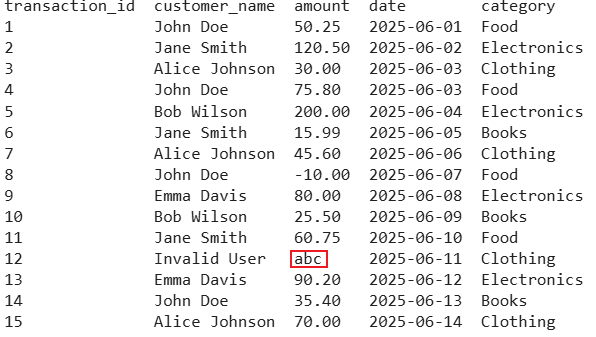
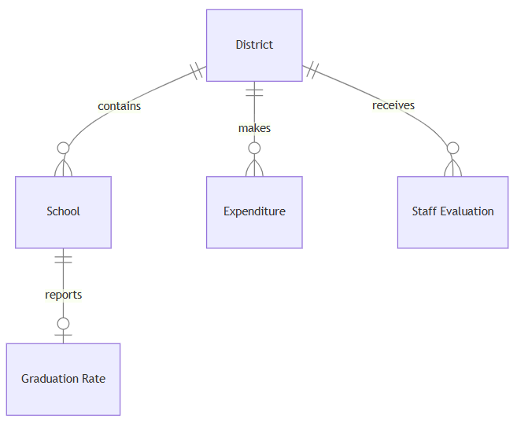
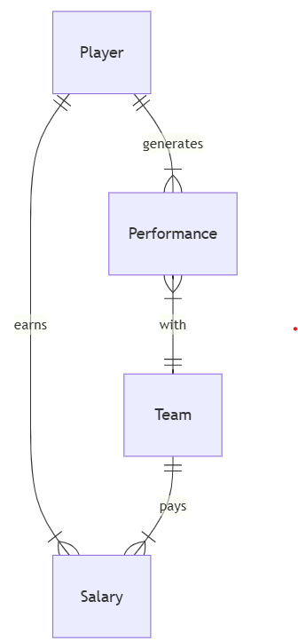

# Relating images
**Fig: Data Engineering Life Cycle**

**Fig: Data Science Hierarchy**

**Fig: Invalid amount data**

**Fig: Sample data pipeline**

**Fig: Cyberchase Database Structure**

**Fig: LongList ER Diagram**

**Fig: Longlist version 2 Database Structure**

**Fig: Package ER Diagram**

**Fig: DESE ER Diagram**

**Fig: Monkeyball ER Diagram**

**Fig: Boston Subway Map**

